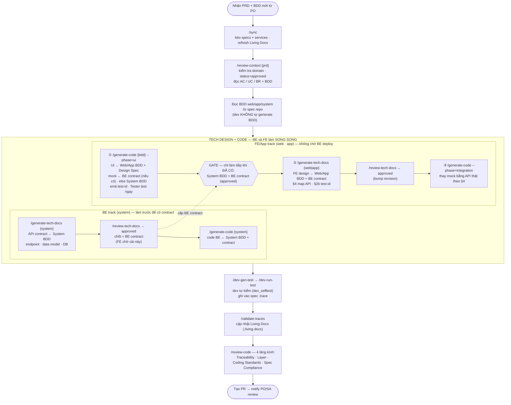

[📚 Docs](../../README.md) › [Guides](../README.md) › [Developer](README.md) › Workflow

# Workflow Cơ Bản

> Sơ đồ render thành flowchart trên GitHub (Mermaid). Bản text ASCII (mở mục bên dưới) là fallback cho viewer không hỗ trợ Mermaid.



> **Full-stack / không tách mock:** chỉ cần BE track — chạy `/generate-code {bdd}` một lần (bỏ qua FE 2-phase).

<details>
<summary>Bản text (ASCII fallback — cho viewer không render Mermaid)</summary>

```
Nhận thông báo PRD + BDD mới từ PO
        │
        ▼
/sync                                          # pull specs + services + refresh Living Docs (1 lệnh, preferred)
(tương đương raw: git submodule update --remote my-project-specs — lấy spec mới nhất, gồm BDD PO đã gen)
        │
        ▼
/review-context {prd-file}
→ Kiểm tra Domain, Status = approved (bảng Metadata PRD)
→ Đọc hiểu AC, UC, BR trong PRD
→ Đọc BDD tương ứng trong specs/{domain}/{prd-slug}/bdd/{platform}/
→ Nếu có gì không rõ: hỏi PO TRƯỚC khi tiếp tục
        │
        ▼
(Đọc BDD từ spec submodule — KHÔNG tự generate BDD)
FE/Web:  my-project-specs/specs/{domain}/{prd-slug}/bdd/web/{TICKET-ID}-UC*.feature
App:     my-project-specs/specs/{domain}/{prd-slug}/bdd/app/{TICKET-ID}-UC*.feature
BE:      my-project-specs/specs/{domain}/{prd-slug}/bdd/system/{TICKET-ID}-UC*.feature
        │
        ▼
══════════ TECH DESIGN + CODE — BE track & FE track CHẠY SONG SONG ══════════
(/generate-tech-docs là platform-aware: đọc @trace.platform → BE = API contract · FE/App = client design)

BE track (system)   ── làm trước, sinh ra "BE contract" ──
  /generate-tech-docs {system}   → API contract: endpoints · data model · DB · caching
  /review-tech-docs → APPROVED   → đây CHÍNH LÀ "BE contract" mà FE chờ
  /generate-code {system}        → code theo BDD (@trace.bdd)
  (full-stack / không tách mock: chỉ cần track này — /generate-code {bdd} một lần)


FE/App track (web|app)   ── KHÔNG chặn chờ BE ──

  ① BẮT ĐẦU NGAY (song song với BE):
     /generate-code {bdd} --phase=ui      → UI + mock adapter
        • UI ← Web/App BDD + Design Spec
        • mock shape = BE contract nếu có, else System BDD (+warn)
        • fixture values: LUÔN từ System BDD
        • emit test-id (convention {uc}-{screen}-{element}-{type})
        • Tester test FE NGAY (không cần BE deploy API)
                            │
        ╔═══════════════════▼═══════════ GATE ═══════════════════
        ║  Chỉ mở khi CÓ:  System BDD  +  BE contract (approved, từ track BE)
        ╚═══════════════════╤════════════════════════════════════
                            ▼
     ② /generate-tech-docs {web|app}      → FE client design (GATED)
          • components · state
          • §4 API-integration map THEO BE contract
          • §2b Test Selectors (test-id cho element có action)
        /review-tech-docs → approved (bump revision)
                            ▼
     ③ /generate-code {bdd} --phase=integration
          → wire real API theo §4 FE tech-design (thay mock)
        │
        ▼
/dev-gen-test {bdd-file}
→ Gen unit test (dev self-check, không phải coverage chính thức)
→ /dev-run-test để verify → ghi dev_selftest (pass/fail) + dev_selftest_at vào TSV authoritative {spec_source}/.trace (commit 1 tầng ở spec repo)
→ /validate-traces (hoặc /sync) → regenerate report Living Docs {spec_source}/.living-docs/ (gitignored)
        │
        ▼
/review-code {files}
→ 4 lăng kính: Traceability / Layer Architecture / Coding Standards / Spec Compliance
→ Fix issues trước khi tạo PR
        │
        ▼
Tạo PR → notify PO/SA review
```

</details>

> **Vì sao đúng thứ tự này? — Chuỗi outside-in.** Toàn bộ pipeline đi từ ngoài (client) vào trong (hệ thống):
> 1. **PO gen BDD: web → app → System** — System BDD (BE) được **tổng hợp từ web+app BDD** (hành vi client định nghĩa trước, BE/system suy ra để phục vụ các flow đó). *(Project chỉ-BE: System BDD gen thẳng từ PRD.)*
> 2. **BE tech-docs trước** — API contract dẫn xuất từ **System BDD**.
> 3. **FE/App tech-docs sau (GATED)** — cần **System BDD + BE contract approved**; §4 map theo BE contract.
>
> FE **không** bị chặn chờ BE nhờ `--phase=ui` (mock shape: BE contract nếu có, else System BDD), rồi `--phase=integration` wire API thật khi contract đã có. Chi tiết flow: [Concepts › Pipeline](../../03-concepts/pipeline.md).

> **Commit ở đâu, push mấy tầng?** Code nằm trong service submodule → **commit 2 tầng** (service rồi umbrella pointer). Tech-docs + `.trace/` (dev_selftest/qc_status) đẩy lên **spec repo** (1 tầng, cross-repo). Sơ đồ git đầy đủ theo từng role: [Sync & Update — Git flow theo role](../../04-operations/sync-and-update.md#ai-commit-vào-repo-nào-git-flow-theo-role).

---

← [BDD & Trace System](bdd-and-trace.md) · Tiếp theo: [Tình huống thực tế](scenarios.md)
