[📚 Docs](../README.md) › [Reference](README.md) › Command Cheat-Sheet

# Command Cheat-Sheet — luồng & chọn lệnh

> Bối rối không biết **chạy lệnh nào, theo thứ tự nào, ai chạy**? Trang này là bản đồ 1 trang. Chi tiết Input/Output từng lệnh: [Command Reference](commands.md).

- [Luồng end-to-end (ai chạy gì)](#luồng-end-to-end-ai-chạy-gì)
- [Tôi muốn REVIEW thứ này → dùng lệnh nào?](#tôi-muốn-review-thứ-này--dùng-lệnh-nào)
- [Vòng review chuẩn: 3 bước (review → Board → resume)](#vòng-review-chuẩn-3-bước-review--board--resume)
- [Giải mã flag: mặc định vs --fix vs --resume](#giải-mã-flag-mặc-định-vs---fix-vs---resume)
- [QC pipeline — 6 bước tuần tự](#qc-pipeline--6-bước-tuần-tự)
- [dev-* vs qc-* — đừng nhầm](#dev--vs-qc---đừng-nhầm)

---

## Luồng end-to-end (ai chạy gì)

Mỗi mũi tên = "xong cái trước mới sang cái sau". Nhãn dưới mỗi lệnh là **vai trò** chạy nó.

```mermaid
flowchart LR
  A["/define-product<br/><b>PO</b>"] --> B["/generate-prd<br/><b>PO</b>"]
  B --> C["/refine-prd<br/><b>PO</b> + Board"]
  C --> D["/review-context (PRD)<br/><b>PO</b> · cổng chất lượng"]
  D -->|"PO đặt Status: approved"| E["/generate-design-spec<br/><b>PO</b> (chỉ FE/App)"]
  E --> F["/generate-bdd<br/><b>PO</b> · web→app→system"]
  F --> G["/review-context (BDD)<br/><b>SA/Dev</b>"]
  G -->|"đặt @trace.status: approved"| H["/generate-tech-docs<br/><b>Dev</b> · BE trước, FE sau"]
  H --> I["/review-tech-docs<br/><b>Dev</b> + Board"]
  I --> J["/generate-code<br/><b>Dev</b>"]
  J --> K["/review-code<br/><b>Dev</b> · 4 lens"]
  K --> L["/dev-gen-test → /dev-run-test<br/><b>Dev</b> · self-check"]
  L --> M["/qc-* (6 bước)<br/><b>QC/Tester</b>"]
  M --> N["/validate-traces<br/><b>Tech Lead</b>"]
```



> **BE bỏ qua Design Spec** (bước E) — đọc PRD trực tiếp rồi `/generate-bdd`. **Full-stack/không tách mock** → `/generate-code` một lần (bỏ qua FE 2-phase). Cross-cutting (`/sync`, `/fix-bug`, `/debug`, `/learn`, `/report-bug`, `/propose-scenario`) chạy bất cứ lúc nào, không nằm trong chuỗi này.

<details>
<summary>Bản text (ASCII fallback)</summary>

```
PO ───────────────────────────────────────────────────────────────────────────
  /define-product → /generate-prd → /refine-prd → /review-context(PRD) → PO đặt Status: approved
                                                   → /generate-design-spec (FE/App)
                                                   → /generate-bdd (web→app→system)
SA/Dev ────────────────────────────────────────────────────────────────────────
  /review-context(BDD) → đặt @trace.status: approved → /generate-tech-docs → /review-tech-docs
                       → /generate-code → /review-code → /dev-gen-test → /dev-run-test
QC/Tester ──────────────────────────────────────────────────────────────────────
  /qc-analyze → /qc-plan → /qc-design-test → /qc-review → /qc-run-test → /qc-report
Tech Lead ──────────────────────────────────────────────────────────────────────
  /validate-traces
```
</details>

---

## Tôi muốn REVIEW thứ này → dùng lệnh nào?

Có **4 lệnh review** cho **4 loại artifact khác nhau**. Đây là điểm hay nhầm nhất:

| Tôi muốn review… | Cách dùng (ví dụ) | Nó kiểm cái gì | Ai chạy |
|---|---|---|---|
| **PRD — nội dung & độ đầy đủ** | `/refine-prd specs/auth/login/{TICKET-ID}-login.md` | 3 lens DEV·SA·PO (đọc bằng mắt kỹ thuật, viết bằng lời nghiệp vụ): luồng đủ rõ để build chưa? nhất quán nghiệp vụ? scope & mục tiêu rõ? | PO |
| **PRD — chất lượng trước khi approve** | `/review-context specs/auth/login/{TICKET-ID}-login.md` | P-checks: banned term, mơ hồ, mâu thuẫn PRD khác, thiếu section, routing theo `Domain` (bảng Metadata) | PO |
| **BDD `.feature`** | `/review-context specs/auth/login/bdd/system/FEAT-01-UC1-login.feature` | B-checks: mỗi AC/BR → có ≥1 scenario? Gherkin R1–R10, compliance C1–C5 | SA/Dev |
| **Tech design** | `/review-tech-docs specs/auth/login/tech-docs/FEAT-01-tech-design.md` | T-checks: đúng layer/architecture, entity, trace BDD, cross-team API sign-off | Dev/SA |
| **Code** | `/review-code FEAT-01-UC1` | 4 lăng kính: Traceability · Layer Architecture · Coding Standards · Spec Compliance | Dev |

> **Vì sao PRD có 2 lệnh review?** `/refine-prd` làm **trước** (cải thiện nội dung, fan-out 3 lens). `/review-context` làm **sau** như **cổng chất lượng cuối** trước khi approve + sang BDD. Thứ tự: `generate-prd → refine-prd → review-context → approve`.
>
> **Vì sao `/review-context` dùng cho cả PRD lẫn BDD?** Nó tự nhận loại theo file: `.md` ở gốc feature folder → PRD mode (P-checks); `.feature` → BDD mode (B-checks). Cùng một "cổng chất lượng", hai bộ tiêu chí.

---

## Vòng review chuẩn: 3 bước (review → Board → resume)

Mọi lệnh review (`/refine-prd`, `/review-context`, `/review-tech-docs`) đều chạy **cùng một vòng 3 bước**. Lệnh review **không sửa file** — nó chỉ ghi ra findings; bạn duyệt ở Review Board; rồi `--resume` mới áp dụng.

```
①  /refine-prd {file}                 ②  Mở Review Board (extension)        ③  /…  --resume {file}
   ───────────────────────────           ──────────────────────────────        ──────────────────────────
   PHÂN TÍCH (read-only)        →         DUYỆT từng finding:            →       ÁP DỤNG cái đã accept
   ghi .agent/review/                     ✓Accept ✎Modify ⏸Defer ✗Reject        + bump version + reset draft + changelog
   {slug}-findings.yaml                   💬 Giải thích (nếu khó hiểu)
```

- **① không đụng vào file gốc.** An toàn chạy bất cứ lúc nào.
- **② Review Board** = panel của extension *Spec Driven Docs Tools*. Right-click file `*-findings.yaml` → Open Review Board, hoặc bấm thông báo khi findings vừa tạo. Finding khó hiểu → bấm **💬 Giải thích** (no-tech + đề xuất phương án, chờ confirm).
- **③ `--resume`** đọc các finding `accepted`/`modified` và áp vào file gốc, rồi bump version. Nút **⚡ Apply** trên Board tự chạy đúng lệnh `--resume` này cho bạn.

---

## Giải mã flag: mặc định vs --fix vs --resume

Cùng một lệnh `/review-context` (và họ review nói chung) có **3 chế độ**. Đây là khác biệt:

| Chế độ | Lệnh | Làm gì | Khi nào |
|---|---|---|---|
| **Phân tích** (mặc định, không flag) | `/review-context {file}` | Chỉ phân tích → ghi findings. **Không sửa file.** | Bước ① mọi vòng review |
| **`--fix`** | `/review-context --fix {file}` | Phân tích **rồi tự áp ngay** các finding `auto_fixable` (banned term, metadata, coverage matrix…). Bỏ qua Board. | Dev muốn dọn nhanh lỗi máy-sửa-được, không cần người quyết |
| **`--resume`** | `/review-context --resume {file}` | **Không phân tích lại.** Đọc findings file, áp các finding **người đã accept** ở Board. | Bước ③ sau khi duyệt ở Board |

> **Nhớ nhanh:** `--fix` = "máy tự sửa cái an toàn **ngay**" · `--resume` = "áp cái **tôi đã duyệt**". Không flag = "chỉ xem, đừng động vào file".

---

## QC pipeline — 6 bước tuần tự

QC là **chuỗi 6 lệnh chạy theo thứ tự** sau khi BDD `@trace.status: approved`. Output bước trước là input bước sau:

```
/qc-analyze → /qc-plan → /qc-design-test → /qc-review → /qc-run-test → /qc-report
   scope         test         test-case        duyệt        chạy +          report
   + gaps        plan         chi tiết         TC/script    qc_status       HTML
```

| # | Lệnh | Ra cái gì |
|---|---|---|
| 1 | `/qc-analyze` | `REQUIREMENT_ANALYSIS.md` + `DOC_GAPS.md` |
| 2 | `/qc-plan` | `TEST_PLAN.md` (scope, layer, ưu tiên) |
| 3 | `/qc-design-test` | `test-cases/*.Test.md` |
| 4 | `/qc-review` | Verdict APPROVED / NEEDS_FIX (inline) |
| 5 | `/qc-run-test` | Script Python + ghi `qc_status` vào trace TSV |
| 6 | `/qc-report` | `report.html` (Playwright trace + pytest-html) |

> Chi tiết: [chương QC Automation](../02-guides/tester/qc-automation.md). Stack `qc-playwright`, độc lập với module code của dev.

---

## dev-* vs qc-* — đừng nhầm

Hai luồng test **tách biệt**, ghi **hai cột khác nhau** trong trace TSV:

| | `/dev-*` (dev self-check) | `/qc-*` (QC chính thức) |
|---|---|---|
| Ai chạy | **Dev** — tự kiểm code mình | **QC/Tester** |
| Lệnh | `/dev-gen-test` · `/dev-run-test` · `/dev-smoke-test` | `/qc-analyze` … `/qc-report` (6 bước) |
| Ghi signal | `dev_selftest` (pass/fail/not_run) | `qc_status` (pass/fail/skip/not_run) |
| Là coverage chính thức? | **KHÔNG** — chỉ tín hiệu "dev đã smoke" | **CÓ** — coverage authoritative |

> Cả hai hiển thị **cạnh nhau** trong Living Docs. `dev_selftest: pass` **không** thay thế QC. Xem [Traceability](../03-concepts/traceability.md#hai-tín-hiệu-test-dev_selftest-vs-qc_status).

---

*Xem thêm:* [Command Reference (chi tiết)](commands.md) · [Concepts › Pipeline](../03-concepts/pipeline.md) · [Developer › Workflow](../02-guides/developer/workflow.md)
