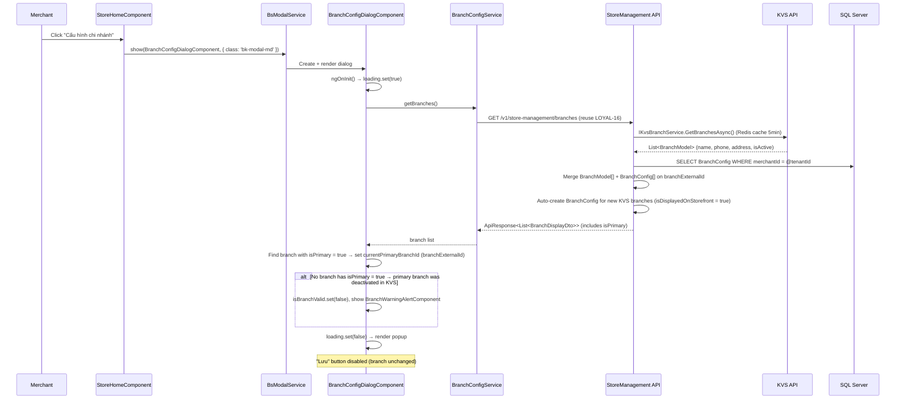
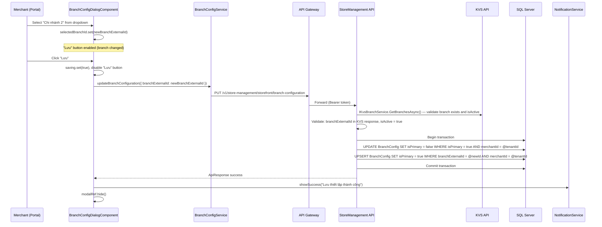
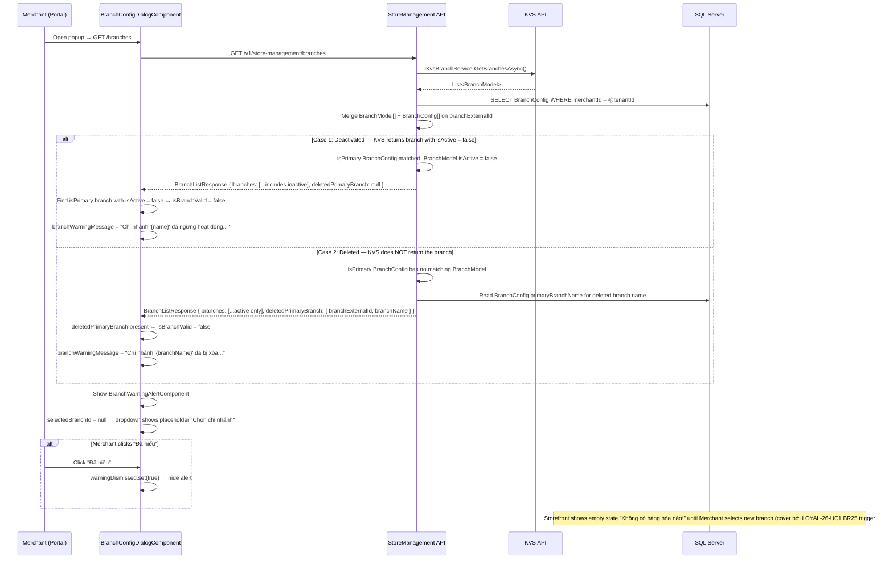
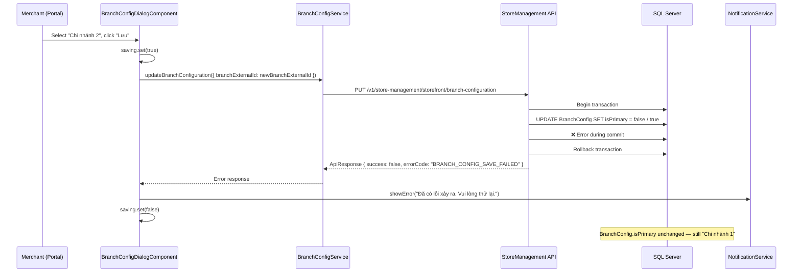
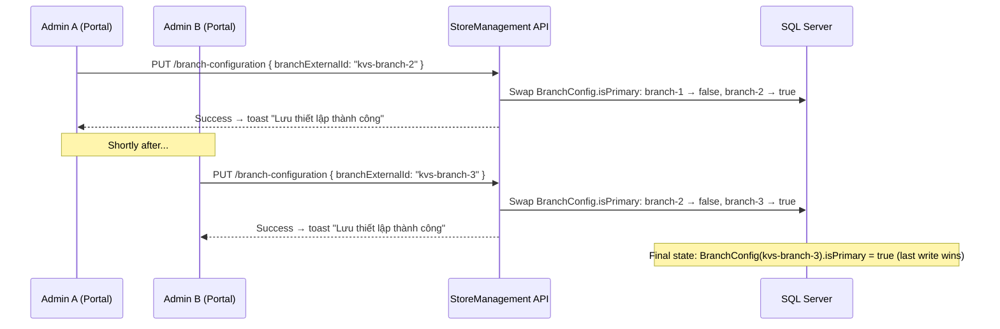
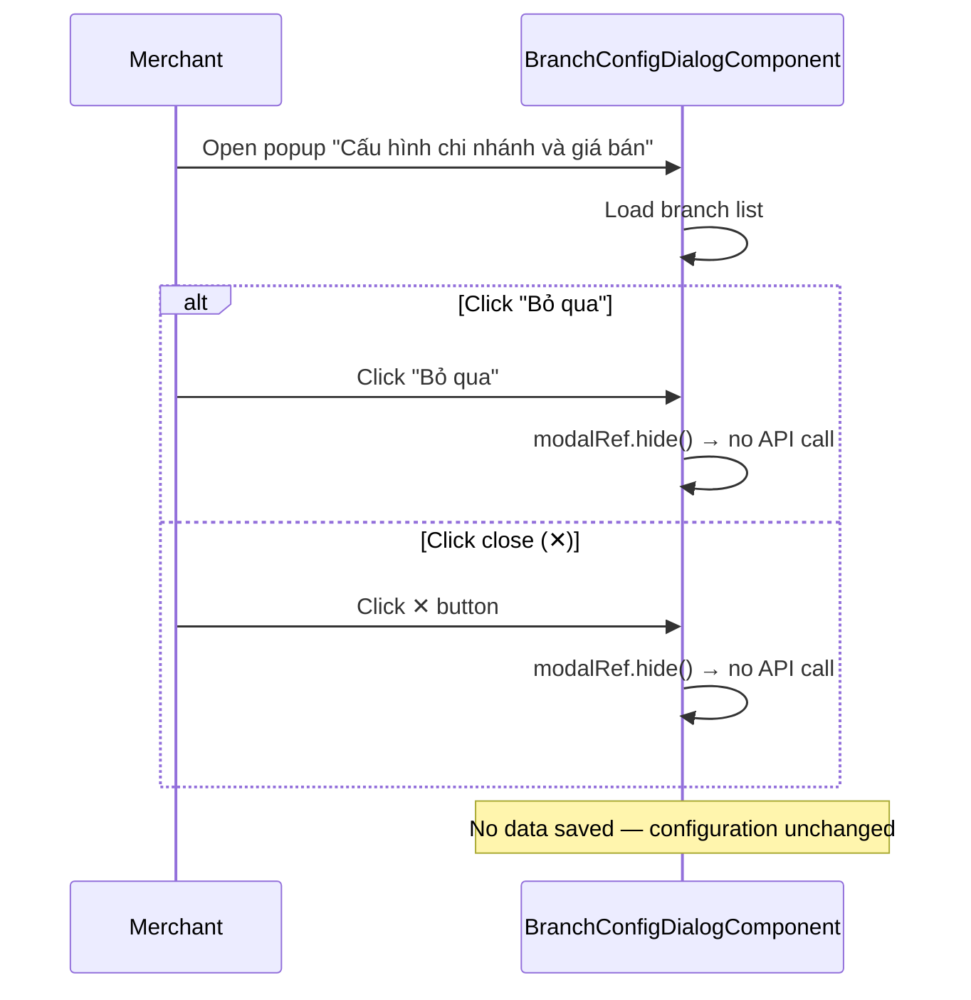
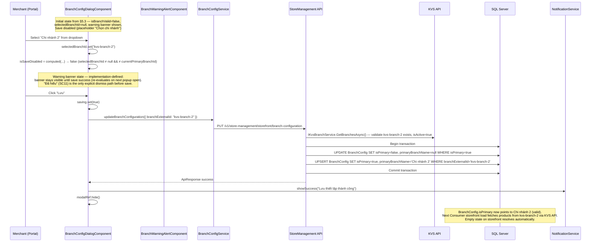
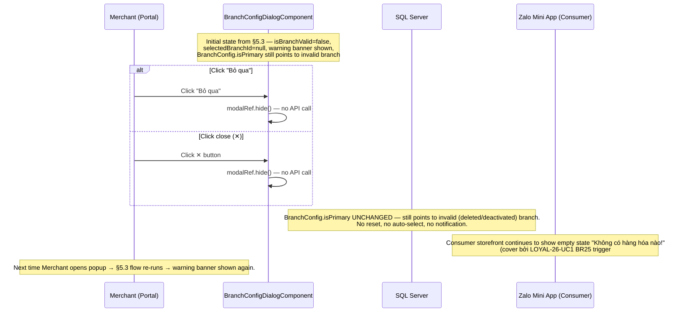
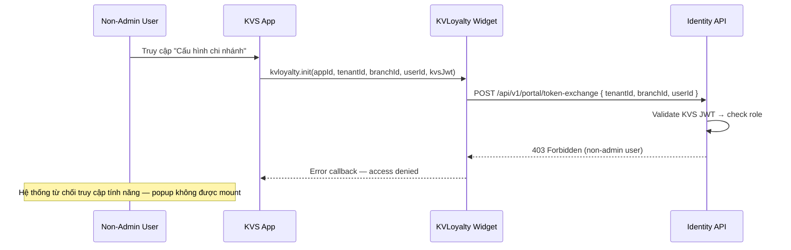

# Store Management — Branch Configuration & Price List Technical Design Document

<!-- @trace.domain: store-management -->
<!-- @trace.uc: LOYAL-23-UC1, LOYAL-23-UC2 -->
<!-- @trace.prd: LOYAL-23 -->

> **Related doc:** [Store Management — Configuration (LOYAL-16)](./store-management-configuration-technical-design.md) — covers store info, images, delivery/payment settings, branch display toggle.

## 1. Overview

The Branch Configuration module allows Merchants (admin accounts) to configure which branch serves as the **order-receiving branch (chi nhánh nhận đơn)** for their Zalo Mini App storefront. Branch base data comes from KVS API (via `IKvsBranchService`); loyalty-owned config (`isPrimary`) is stored in `BranchConfig` DB table. This module only selects which branch is primary. The module also displays the applied price list (always "Bảng giá chung", read-only).

This module operates **post-onboarding** and is accessed via a dedicated popup "Cấu hình chi nhánh và giá bán", separate from the store settings popup (LOYAL-16).

### Goals
- Allow Merchants to change the primary branch (chi nhánh nhận đơn) for order receiving
- Warn Merchants when the configured primary branch becomes invalid (deleted/deactivated in KVS)
- Display the applied price list (always "Bảng giá chung", read-only)
- Preserve existing orders' branch assignment when primary branch changes
- Enforce admin-only access

### Business Actors

| Actor | Description | Channel |
|-------|-------------|---------|
| Merchant (admin) | Store owner with admin permissions who configures primary branch | KVS → KVLoyalty Widget → Portal (iframe) → StoreManagement API |

---

## 2. Architecture Overview

### 2.1 High-level Architecture

```
┌─────────────┐     ┌─────────────────┐     ┌──────────────────────┐
│   KVS App   │────▶│ KVLoyalty Widget │────▶│   KVLoyalty Portal   │
│  (Partner)  │     │   (CDN JS)      │     │   (Angular 19)       │
└─────────────┘     └─────────────────┘     └──────────┬───────────┘
                                                       │ REST (Bearer)
                                                       ▼
                                            ┌──────────────────────┐
                                            │  API Gateway         │
                                            │  (HAProxy)           │
                                            └──────────┬───────────┘
                                                       │
                              ┌─────────────────────────┤
                              ▼                         ▼
                   ┌──────────────────┐      ┌─────────────────┐
                   │ StoreManagement  │      │  Identity API   │
                   │     API          │      │                 │
                   └────────┬─────────┘      └─────────────────┘
                            │
                   ┌────────┴─────────┐
                   ▼                  ▼
          ┌──────────────┐   ┌──────────────┐
          │  SQL Server  │   │   KVS API    │
          │ (Sharded DB) │   │ (Branch data)│
          └──────────────┘   └──────────────┘
```

> **Note:** Branch base data (name, phone, address, isActive) is fetched live from KVS API via `IKvsBranchService` (same pattern as Product). Loyalty-owned config (`isPrimary`, `isDisplayedOnStorefront`) is stored in `BranchConfig` DB table.

### 2.2 Communication Patterns

| Pattern | Usage | Scope |
|---------|-------|-------|
| KVS → Widget → Portal → API | Token Exchange (Bearer, RS256) — Merchant actions via Portal iframe | LOYAL-23-UC1 |
| Portal → StoreManagement API | REST — Read branch list (reuse LOYAL-16 API), update `isPrimary` flag in BranchConfig | LOYAL-23-UC1, UC2 |
| StoreManagement API → KVS API | REST (KVS-Merchant-Id header) — Fetch branch base data via `IKvsBranchService` (Redis cache 5min) | LOYAL-23-UC1 |

---

## 3. Data Model

### 3.1 Entity Design

This module uses the **API-sourced model + DB config** pattern introduced in LOYAL-16-UC1. See [LOYAL-16 §3.1](./store-management-configuration-technical-design.md) for full entity definitions.

#### BranchModel (API-sourced POCO — see `core-entities.md` §3)

Branch base data is fetched live from KVS API via `IKvsBranchService`. Not a DB entity.

| Field | Type | Usage in LOYAL-23 |
|-------|------|-------------------|
| `externalId` | `string` | KVS branch ID — used as join key with BranchConfig |
| `name` | `string` | Display name in dropdown and warning messages |
| `isActive` | `boolean` | From KVS API. When primary BranchConfig exists but `isActive = false` → branch is DEACTIVATED → warning shown |
| `createdAt` | `datetime` | From KVS API. Used for sorting branches in dropdown (newest first — SC2) |

#### BranchConfig (DB Entity — see LOYAL-16 §3.1)

Loyalty-owned config per branch. `isPrimary` is the order-receiving branch flag.

| Field | Type | Usage in LOYAL-23 |
|-------|------|-------------------|
| `branchExternalId` | `string` | Cross-reference → KVS branch ID |
| `isPrimary` | `boolean` | `true` = this branch is the order-receiving branch. Only 1 per Merchant. Changed via PUT endpoint. |
| `primaryBranchName` | `string?` | Snapshot of branch name at time `isPrimary` was set. Used to display warning message when branch is deleted from KVS (KVS API no longer returns the branch, so name is unavailable). Updated on every `isPrimary` swap. Only meaningful when `isPrimary = true`. |
| `isDisplayedOnStorefront` | `boolean` | Managed by LOYAL-16 — not modified by LOYAL-23 |

**Branch state transitions (merged view):**

```
Normal:      BranchConfig.isPrimary = true,  BranchModel found, isActive = true    → ✅ Valid
Deactivated: BranchConfig.isPrimary = true,  BranchModel found, isActive = false   → ⚠️ Warning "đã ngừng hoạt động" (name from BranchModel)
Deleted:     BranchConfig.isPrimary = true,  BranchModel NOT found in KVS response → ⚠️ Warning "đã bị xóa" (name from BranchConfig.primaryBranchName)
Changed:     BranchConfig.isPrimary = false, BranchModel found, isActive = true    → Old primary (after merchant selects new)
```

**Constraints:**
- Exactly 1 BranchConfig per Merchant with `isPrimary = true` (enforced in application logic)
- `isPrimary` is a KVLoyalty-owned field — stored in `BranchConfig` DB table
- When a new KVS branch appears without a `BranchConfig` record, one is auto-created with `isPrimary = false`

### 3.2 Entity Relationships

```
Merchant (1:N) → BranchConfig (only 1 has isPrimary = true = chi nhánh nhận đơn)
                    ├── branchExternalId ───── BranchModel (KVS API)
                    │                           ├── name, contactNumber, address  [read-only]
                    │                           └── isActive                      [read-only]
                    ├── isPrimary              [determines order-receiving branch]
                    └── isDisplayedOnStorefront [managed by LOYAL-16]
```

> **Note:** Order–Branch association (BR2: orders keep original branch) will be designed in the Order module scope.

### 3.3 Data Source Boundaries

**LOYAL-23 scope: READ merged branch list (KVS API + BranchConfig DB) + WRITE `isPrimary` flag in BranchConfig.**

Branch base data (name, phone, address, isActive) is fetched live from KVS API — no SyncData dependency.

| Responsibility | LOYAL-23 Scope | Handled By |
|---|---|---|
| ✅ Read branch list (KVS API + BranchConfig merge) | Yes | Reuse `GET /v1/store-management/branches` (LOYAL-16) |
| ✅ Update `isPrimary` flag | Yes | StoreManagement API (swap on BranchConfig rows) |
| ❌ Branch base data (name, phone, address) | Read-only | KVS API via `IKvsBranchService` (Redis cache 5min) |
| ❌ Products/categories/inventory display | No | API-sourced via `IProductCatalogService` → `IKvsProductService` → KVS API (Redis 10min). Storefront queries use isPrimary branch to determine which branch's products to fetch from KVS. |

**Data flow when primary branch changes:**

```
Merchant selects new branch in Portal
  ↓
PUT /branch-configuration { branchExternalId: "..." }
  ↓
StoreManagement API: UPSERT BranchConfig SET isPrimary = true/false
  + UPDATE BranchConfig SET primaryBranchName = @newBranchName WHERE isPrimary = true
  ↓
Done — next storefront product load uses new isPrimary branch to fetch products from KVS API
```

### 3.4 Multi-tenant & Sharding

Same as other store-management modules:
- All entities carry `MerchantId` = `TenantId`
- EF Core Global Query Filters enforce tenant isolation
- Shard resolution via `IShardResolver.ResolveAsync(appId, tenantId)` during auth middleware

---

## 4. API Contracts

### 4.1 Endpoints

```
GET    /v1/store-management/branches                              # REUSE (LOYAL-16) — branch list for dropdown
PUT    /v1/store-management/storefront/branch-configuration       # NEW — Update order-receiving branch (isPrimary swap)
```

> **`GET /v1/store-management/branches`** already exists (LOYAL-16, `StorefrontController`). Returns `ApiResponse<List<BranchDisplayDto>>` with merged view: KVS branch data (`BranchExternalId, Name, ContactNumber, Address, IsActive`) + BranchConfig DB flags (`IsPrimary, IsDisplayedOnStorefront`).
>
> `BranchDisplayDto` already includes `IsPrimary` field (from BranchConfig DB table). Portal uses `branchExternalId` (string) as the branch identifier.

### 4.2 Request/Response Models

#### BranchDisplayDto (defined in LOYAL-16 — reused here)
<!-- uses BranchExternalId as identifier per LOYAL-16 Branch→BranchConfig split -->

```csharp
public class BranchDisplayDto
{
    public string BranchExternalId { get; set; } = default!; // KVS branch ID — join key
    public string Name { get; set; } = default!;             // From BranchModel (KVS API)
    public string? ContactNumber { get; set; }               // From BranchModel (KVS API)
    public string? Address { get; set; }                     // From BranchModel (KVS API)
    public bool IsActive { get; set; }                       // From BranchModel (KVS API)
    public DateTime CreatedAt { get; set; }                  // From BranchModel (KVS API) — used for sorting (newest first, SC2)
    public bool IsPrimary { get; set; }                      // From BranchConfig (DB) — true = chi nhánh nhận đơn
    public bool IsDisplayedOnStorefront { get; set; }        // From BranchConfig (DB) — managed by LOYAL-16
}
```

> **Warning detection (client-side):** Portal loads branch list (merged KVS + BranchConfig). Two invalid cases:
> 1. **Deactivated:** isPrimary BranchConfig exists AND KVS branch has `isActive = false` → warning "đã ngừng hoạt động". Branch name available from `BranchModel.name`.
> 2. **Deleted:** isPrimary BranchConfig exists AND NO matching branch in KVS response → warning "đã bị xóa". Branch name from `BranchConfig.primaryBranchName` (snapshot stored at time of isPrimary set).
>
> For the **deactivated** case, the merge logic includes the branch in `BranchDisplayDto[]` with `IsActive = false`. For the **deleted** case, the API returns a metadata field `deletedPrimaryBranch` (see below) since there's no BranchModel to merge with.

#### InvalidPrimaryBranchInfo (NEW — returned alongside BranchDisplayDto[] when primary branch is deleted)

```csharp
public class BranchListResponse
{
    public List<BranchDisplayDto> Branches { get; set; } = new();
    public InvalidPrimaryBranchInfo? DeletedPrimaryBranch { get; set; }  // non-null when isPrimary branch not found in KVS
}

public class InvalidPrimaryBranchInfo
{
    public string BranchExternalId { get; set; } = default!;  // from BranchConfig.branchExternalId
    public string BranchName { get; set; } = default!;        // from BranchConfig.primaryBranchName (snapshot)
}
```
>
> **Price list (UC2):** Hardcoded in Portal as "Bảng giá chung" (read-only label). No backend field needed — per UC2-BR1, it's always fixed.

#### Update Branch Configuration (NEW)

```csharp
// PUT /v1/store-management/storefront/branch-configuration
// Request:

public class UpdateBranchConfigurationRequest
{
    public string BranchExternalId { get; set; } = null!;     // KVS branch ID (cross-reference key)
}

// Response: ApiResponse<object>
```

**Validation Rules (FluentValidation):**

```csharp
public class UpdateBranchConfigurationValidator : AbstractValidator<UpdateBranchConfigurationRequest>
{
    public UpdateBranchConfigurationValidator()
    {
        RuleFor(x => x.BranchExternalId)
            .NotEmpty().WithMessage("Vui lòng chọn chi nhánh nhận đơn");
    }
}
```

**Handler logic (UpdateBranchConfigurationHandler):**
1. Fetch branches from KVS API via `IKvsBranchService.GetBranchesAsync()` — validate `BranchExternalId` exists and `isActive = true`
2. Load current primary BranchConfig — if `BranchExternalId` == current primary → return error `BRANCH_NOT_CHANGED`
3. Get branch name from KVS response: `newBranchName = branches.First(b => b.ExternalId == request.BranchExternalId).Name`
4. Begin transaction:
   a. `UPDATE BranchConfig SET isPrimary = false, primaryBranchName = null WHERE isPrimary = true AND merchantId = @tenantId`
   b. `UPSERT BranchConfig SET isPrimary = true, primaryBranchName = @newBranchName WHERE branchExternalId = @newBranchExternalId AND merchantId = @tenantId`
   c. Commit transaction
5. Return success
6. On error → rollback, return `BRANCH_CONFIG_SAVE_FAILED`

### 4.3 Error Codes

| Code | HTTP Status | Description | Trace |
|------|-------------|-------------|-------|
| `BRANCH_NOT_FOUND` | 400 Bad Request | Selected branch does not exist or does not belong to current tenant | UC1-SC1 |
| `BRANCH_NOT_ACTIVE` | 400 Bad Request | Selected branch is not active (isActive = false) | UC1-SC1 |
| `BRANCH_NOT_CHANGED` | 400 Bad Request | Selected branch is the same as current primary (Save button should be disabled client-side) | UC1-SC7 |
| `BRANCH_CONFIG_SAVE_FAILED` | 500 Internal | System error during branch configuration save | UC1-SC12 |

### 4.5 UI Component Mapping — Branch Configuration Popup (Portal — Angular 19)

> **Source:** Figma — `Merchant` file, node `78:35333` ("Thiết lập đồng bộ" / "Cấu hình chi nhánh và giá bán")
> **Stack:** Angular 19 standalone, Signals, ngx-bootstrap modal, `bk-*` design system
> <!-- @figma.url: https://www.figma.com/design/2AAbMqr0IwzvQffuUDZb4A/Merchant?node-id=78-35333 -->

#### 4.5.1 Component Hierarchy

```
StoreHomeComponent (existing — features/store-management/store-home/)
└── Opens modal via BsModalService ──▶
    BranchConfigDialogComponent (NEW — popup "Cấu hình chi nhánh và giá bán")
    ├── Header: "Cấu hình chi nhánh và giá bán" + close (✕) button
    │
    ├── Section 1: Chi nhánh nhận đơn
    │   ├── Title: "Chi nhánh nhận đơn" (bk-fw-semibold bk-text-md)
    │   ├── Subtitle: "Chi nhánh được chọn dùng để đồng bộ sản phẩm, tồn kho và nhận đơn giao đi từ Zalo."
    │   ├── Dropdown select: branch list (active branches, sorted createdAt DESC)
    │   └── BranchWarningAlertComponent (conditional — only when primary branch is invalid)
    │       ├── Warning icon (orange)
    │       ├── Message text (dynamic per case):
    │       │   ├── Deleted: "Chi nhánh '{name}' đã bị xóa. Vui lòng chọn chi nhánh khác"
    │       │   └── Deactivated: "Chi nhánh '{name}' đã ngừng hoạt động. Vui lòng chọn chi nhánh khác"
    │       └── "Đã hiểu" button → dismisses alert
    │
    ├── Section 2: Thiết lập giá (bordered card, bg gray)
    │   ├── Title: "Thiết lập giá" (bk-fw-semibold bk-text-md)
    │   ├── Subtitle: "Danh sách bảng giá được lọc theo chi nhánh đã chọn..."
    │   ├── Label: "Bảng giá bán"
    │   └── Read-only input: "Bảng giá chung" (select arrow hidden)
    │
    └── Footer: Action Bar
        ├── "Bỏ qua" → secondary button (close without saving)
        └── "Lưu" → primary button (disabled when branch unchanged)
```

#### 4.5.2 Component File Mapping

| Component | Path | Type | Purpose |
|-----------|------|------|---------|
| `BranchConfigDialogComponent` | `features/store-management/store-home/branch-config-dialog/` | Feature | Branch configuration popup — dropdown + save logic |
| `BranchWarningAlertComponent` | `features/store-management/store-home/branch-config-dialog/branch-warning-alert/` | Child | Conditional warning banner when branch is invalid |

#### 4.5.3 State Management (Signals)

```typescript
// BranchConfigDialogComponent — signal-based state
selectedBranchId = signal<string | null>(null);            // KVS branchExternalId of selected branch in dropdown
currentPrimaryBranchId = signal<string | null>(null);      // original isPrimary branch (from GET /branches)
availableBranches = signal<IBranchDisplay[]>([]);           // from GET /v1/store-management/branches (reuse LOYAL-16)
deletedPrimaryBranch = signal<IInvalidPrimaryBranchInfo | null>(null); // non-null when isPrimary branch deleted from KVS
isBranchValid = signal(true);                               // false when primary branch deactivated OR deleted
branchWarningMessage = signal<string | null>(null);         // derived — see derivation logic below
warningDismissed = signal(false);                           // "Đã hiểu" clicked
branchDropdownPlaceholder = signal('Chọn chi nhánh');       // shown when isBranchValid = false (SC9)
priceListName = signal('Bảng giá chung');                   // always fixed (UC2)
saving = signal(false);                                      // loading state during save
isSaveDisabled = computed(() =>                              // Lưu button state
  this.saving() ||
  this.selectedBranchId() === this.currentPrimaryBranchId() ||
  this.selectedBranchId() === null
);
```

**Branch list filter + sort (client-side, SC2):**
```typescript
// API GET /branches returns ALL branches (including isActive = false) so client can detect SC9 warnings.
// For dropdown rendering: filter active + sort newest first (createdAt DESC).
const displayBranches = branches
  .filter(b => b.isActive)
  .sort((a, b) => new Date(b.createdAt).getTime() - new Date(a.createdAt).getTime());
availableBranches.set(displayBranches);
```

**Warning message derivation (client-side, SC9):**
```typescript
// After loading branch list response:
// Case 1: Deactivated — isPrimary branch found in list with isActive = false
const primaryBranch = branches.find(b => b.isPrimary);
if (primaryBranch && !primaryBranch.isActive) {
  isBranchValid.set(false);
  selectedBranchId.set(null);  // dropdown shows placeholder "Chọn chi nhánh"
  branchWarningMessage.set(`Chi nhánh '${primaryBranch.name}' đã ngừng hoạt động. Vui lòng chọn chi nhánh khác`);
}
// Case 2: Deleted — deletedPrimaryBranch present in response (no matching BranchModel from KVS)
if (response.deletedPrimaryBranch) {
  isBranchValid.set(false);
  selectedBranchId.set(null);  // dropdown shows placeholder "Chọn chi nhánh"
  branchWarningMessage.set(`Chi nhánh '${response.deletedPrimaryBranch.branchName}' đã bị xóa. Vui lòng chọn chi nhánh khác`);
}
```

**Portal TypeScript model** reuses `IBranchDisplay` from LOYAL-16 (see [LOYAL-16 §4.5.3](./store-management-configuration-technical-design.md)):
- Branch identifier is `branchExternalId: string` (KVS branch ID)
- `isDeleted` removed — KVS API only returns active branches; inactive = `isActive: false`
- `IUpdateBranchConfigurationRequest.branchExternalId: string` (was `branchId: number`)

#### 4.5.4 Modal Configuration

```typescript
// Opened from StoreHomeComponent (e.g., "Cấu hình chi nhánh" button)
this.modalService.show(BranchConfigDialogComponent, {
  class: 'bk-modal bk-modal-md bk-modal-center',   // medium popup per Figma (640px)
  animated: true,
  backdrop: 'static',
  keyboard: false,
});
```

#### 4.5.5 Figma → Design System Mapping

| Figma Element | Design System Class | Notes |
|---------------|---------------------|-------|
| Dialog container | `bk-modal bk-modal-md bk-modal-center` | Medium centered modal (640×497px per Figma) |
| Close (✕) button | `bk-modal-close` / icon `xmark` (KV_Icon_Kit) | Top-right, circular 32px button |
| Section title ("Chi nhánh nhận đơn") | `bk-fw-semibold bk-text-md` | 16px semi-bold, #15171a |
| Section subtitle | `bk-text-sm` | 14px regular, #3e464f |
| Branch dropdown | `bk-form-control` (Kendo DropDownList or ngx-bootstrap) | Full width, border-radius 8px, 32px height |
| Warning alert | `bk-alert bk-alert-warning` | bg #fff9f2, border #ffdbb3, border-radius 8px |
| Warning icon | `ik-triangle-warning` (KV_Icon_Kit) | 24px, color #ff8800 |
| "Đã hiểu" button | `bk-btn bk-btn-outline-neutral bk-btn-sm` | 32px height, inside alert action area |
| Price section card | Custom — `bg: var(--bg/layer/level-1, #f7f8f9)`, `border: 1px solid var(--divider/block, #e8eaed)`, `border-radius: 12px`, `padding: 16px` | Contained card for "Thiết lập giá" section |
| "Bảng giá bán" label | `bk-label` | 14px regular, #15171a |
| "Bảng giá chung" input | `bk-form-control` with `readonly` | Select suffix arrow has `opacity: 0` (hidden) |
| "Bỏ qua" button | `bk-btn bk-btn-outline-neutral` | 40px height, min-width 72px |
| "Lưu" button | `bk-btn bk-btn-primary` | 40px height, min-width 72px, bg #0070f4. Disabled when branch unchanged |

---

## 5. Key Flows (Sequence Diagrams)

### 5.1 Happy Path — Open Branch Configuration Popup



### 5.2 Happy Path — Save Branch Configuration (SC1)



### 5.3 Branch Invalid Warning Flow (SC9, SC10, SC11)



### 5.4 Save Error — Rollback Flow (SC12)



### 5.5 Concurrent Access — Last-Write-Wins (SC13)



### 5.6 Cancel/Close Without Saving (SC5, SC6)



### 5.7 Recovery from Warning State (SC14)

> **Context:** Merchant opens popup while primary branch is invalid (KVS deleted/deactivated). Warning banner is shown, dropdown is empty (placeholder), Save is disabled. Merchant selects a valid branch from the dropdown → Save enables → save succeeds → popup closes.



**Key integration points:**

| Step | State transition | Verified by |
|------|------------------|-------------|
| Select branch from dropdown | `selectedBranchId: null → "kvs-branch-2"` | SC14 (When tôi chọn chi nhánh) |
| Save button computed | `isSaveDisabled: true → false` | SC14 (Then hệ thống kích hoạt nút "Lưu") |
| Save backend swap | `BranchConfig.isPrimary: invalid-branch → "kvs-branch-2"` | SC14 (Then hệ thống cập nhật cấu hình) |
| Storefront empty state resolves | Consumer next load fetches from new branch | Cross-system effect (cover bởi LOYAL-26-UC1) |

### 5.8 Cancel During Warning State (SC15)

> **Context:** Merchant opens popup while primary branch is invalid, then clicks "Bỏ qua" or ✕ **without** selecting a new branch. Popup closes; BranchConfig stays pointing at invalid branch; warning persists; Consumer storefront keeps showing empty state. Differs from SC5/SC6 in **state preservation assertion**, not in flow logic.



**Implementation note:** Same `modalRef.hide()` call as SC5/SC6 — no special branch needed in code. Tests assert that after cancel:
- `BranchConfig.isPrimary` row in DB unchanged
- Re-opening the popup re-renders the warning banner (idempotent §5.3 flow)
- No API call made on cancel

---

## 6. Integration Points

| Integration | Direction | Method | Description |
|-------------|-----------|--------|-------------|
| Portal → StoreManagement API | Outbound (client) | REST (Bearer RS256) | Branch list GET (reuse LOYAL-16) + branch config PUT |
| StoreManagement API → KVS API | Outbound (server) | REST (KVS-Merchant-Id header) | Fetch branch base data via `IKvsBranchService` (Redis cache 5min) |

### 6.1 Event Bus (Kafka)

No new Kafka events introduced by LOYAL-23. Branch base data (name, phone, address, isActive) is fetched live from KVS API — no SyncData dependency.

### 6.2 Cross-Service Dependencies

| Dependent Service | What's Needed | Contract | Status |
|---|---|---|---|
| Identity API | Admin gate at token exchange | `POST /api/v1/portal/token-exchange` | ✅ Exists |
| StoreManagement API | Branch list for dropdown | `GET /v1/store-management/branches` — `BranchDisplayDto` includes `IsPrimary` | ✅ Exists |
| KVS API | Branch base data (via IKvsBranchService) | `GET /api/v3/branches` (Redis cache 5min) | ✅ Exists (shared with LOYAL-16) |

> **No new cross-service dependencies.** Only new endpoint: `PUT /storefront/branch-configuration`. `BranchDisplayDto` already includes `IsPrimary` from BranchConfig DB table.

---

## 7. Security & Authorization

### 7.1 Authentication

**Primary flow:** KVS → KVLoyalty Widget → Token Exchange → Portal Session Token (Bearer RS256, 30 min TTL)

Same as LOYAL-16. All Portal → StoreManagement API requests carry `Authorization: Bearer <portalSessionToken>`.

### 7.2 Authorization Rules

> **Admin gate is enforced upstream by Identity API token-exchange (out of scope per BR1).** See §11 (Cross-cutting & Assumptions) for the non-admin denial reference flow.

| Action | Required Role/Permission | Description | Trace |
|--------|--------------------------|-------------|-------|
| View branch configuration | Admin | Popup mounted only after successful token-exchange; admin role enforced upstream | — (out of scope) |
| Update primary branch | Admin | PUT request reaches API only via authenticated portal session; tenant isolation via `MerchantId` filter | SC1 |

---

## 8. Error Handling & Edge Cases

| Scenario | Strategy | Details | Trace |
|----------|----------|---------|-------|
| Primary branch deactivated/deleted in KVS | Warning in popup (client-side) + empty state on Consumer storefront | KVS API returns `isActive = false` OR branch missing → Portal shows warning. **Consumer storefront shows empty state "Không có hàng hóa nào!"** (cover bởi LOYAL-26-UC1 BR25 trigger #3). No auto-replacement. | SC9, SC10, BR3 |
| KVS API unavailable | Graceful degradation | GET /branches returns empty list. Portal shows empty branch dropdown. Config cannot be saved until KVS recovers. | SC9, BR3 |
| Dismiss branch warning | Hide alert (client-side) | "Đã hiểu" hides alert. No API call. | SC11, BR3 |
| Save error | Rollback + error toast | "Đã có lỗi xảy ra. Vui lòng thử lại." Transaction rolled back. | SC12, BR5 |
| Concurrent edits | Last-write-wins | No conflict detection. Second save overwrites first. | SC13, BR5 |
| Cancel/close popup (normal state) | No save | "Bỏ qua" or ✕ closes popup. No API call. | SC5, SC6, BR6 |
| Cancel/close popup (warning state) | No save, state preserved | "Bỏ qua" or ✕ closes popup. `BranchConfig.isPrimary` unchanged (still points to invalid branch). Warning re-renders on next open; Consumer storefront empty state persists. | SC15, BR3, BR6 |
| Recovery from warning state | Save enable on branch select | After choosing valid branch from dropdown, `isSaveDisabled` becomes `false`. Standard save flow follows (§5.7). | SC14, BR3, BR6 |
| Branch unchanged | Save disabled | "Lưu" disabled when `selectedBranchId === currentPrimaryBranchId`. Server rejects with `BRANCH_NOT_CHANGED`. | SC7, BR1 |
| Branch field empty (normal state) | Not possible | Dropdown pre-selects current primary. No empty option. | SC8, BR1 |
| Orders keep original branch | No change | Order–Branch association designed in Order module scope. | SC3, BR2 |
| Price list | Hardcoded | Always "Bảng giá chung", read-only in Portal. No backend field. | UC2-SC1, UC2-SC2, UC2-BR1 |

---

## 9. Design Decisions

| # | Decision | Rationale | Alternatives Considered |
|---|----------|-----------|-------------------------|
| 1 | **Use `BranchConfig.isPrimary` for chi nhánh nhận đơn** | `isPrimary` is a loyalty-owned config field, stored in `BranchConfig` DB table alongside `isDisplayedOnStorefront`. Branch base data (name, phone, address) comes from KVS API. | Store in MerchantSetting JSON — rejected: isPrimary is per-branch, not per-merchant |
| 2 | **Branch base data from KVS API (not DB sync)** | Follows API-sourced model pattern (same as Product). Branch data always fresh from KVS. No sync drift. | SyncData pattern — rejected: eliminated Hybrid entity pattern per architecture alignment |
| 3 | **Reuse `GET /branches` + `BranchDisplayDto` with `IsPrimary`** | API already exists (LOYAL-16). Merged view includes KVS data + BranchConfig flags. No new GET endpoint needed. | Dedicated GET /branch-configuration — rejected: duplicates available data |
| 4 | **Warning detection client-side** | Portal compares branch list: if no branch has `IsPrimary = true` in active list → invalid. KVS `isActive = false` triggers warning. | Backend warning API — rejected: Portal has all the data |
| 5 | **Separate popup from LOYAL-16** | Distinct concern (branch selection vs store info). Confirmed by distinct Figma frames. | Merge into LOYAL-16 popup — rejected: too many concerns |
| 6 | **Last-write-wins** | Consistent with LOYAL-16. Per BR5. | OCC with Revision — rejected per BR5 |
| 7 | **Empty state on Consumer storefront when branch invalid** | Empty state signals fail-safe: Consumer cannot order products from a branch that no longer exists. Avoids serving orphan products. Aligns with LOYAL-26-UC1 BR25 trigger #3. | (a) Frozen old data — rejected: Consumer may try to buy SP from non-existent branch → order errors. (b) Auto-select next branch — rejected per BR3 (no proactive replacement). |
| 8 | **Price list hardcoded** | Per UC2-BR1, always "Bảng giá chung". Frontend constant. | Store in DB — rejected: unnecessary for fixed value |

### NFR-to-Design Mapping

| NFR Category | PRD Requirement | Design Decision |
|---|---|---|
| Multi-tenant isolation | Tenant data never shared | `MerchantId` on BranchConfig + EF Core Global Query Filter |
| Data consistency | Concurrent: last-write-wins (BR5) | DB transaction for BranchConfig.isPrimary swap, no OCC |
| Data consistency | Orders not affected (BR2) | Order–Branch association designed in Order module scope |
| Responsiveness | Changes reflected immediately (BR4) | isPrimary saved synchronously |
| Cross-system consistency | Invalid branch → Consumer storefront empty state (BR3) | Storefront product fetch returns empty when isPrimary branch invalid (cover bởi LOYAL-26-UC1 BR25 trigger #3); resolves automatically once Merchant selects a valid branch |

---

## 10. UC Coverage

| UC | Feature | Sections Covered | Status |
|----|---------|------------------|--------|
| LOYAL-23-UC1 | Cấu hình chi nhánh nhận đơn và đồng bộ dữ liệu | §1–§9 (all sections) | ✅ Covered |
| LOYAL-23-UC2 | Xem và áp dụng bảng giá bán cho gian hàng | §4.2 (price list in UI), §4.5 (Section 2), §8, §9 (#8) | ✅ Covered |

### UC1 Scenario Coverage

| Scenario | Section | Business Rule |
|----------|---------|---------------|
| SC1: Cập nhật chi nhánh nhận đơn | §4.2 (PUT), §5.2 | BR1, BR6 |
| SC2: Chỉ hiển thị chi nhánh active, sắp xếp mới→cũ | §4.2 (GET), §4.5.3 (client filter+sort), §5.1 | BR1 |
| SC3: Giữ nguyên chi nhánh đơn cũ | §3.1 (Order), §8 (delegated to Order module) | BR2 |
| SC4: Đồng bộ sản phẩm theo chi nhánh mới | §3.3 (products API-sourced — isPrimary change causes next product fetch to use new branch via KVS API) | BR4 |
| SC5: "Bỏ qua" (normal state) | §5.6 | BR6 |
| SC6: Close (✕) (normal state) | §5.6 | BR6 |
| SC7: Save disabled khi không đổi | §4.3, §4.5.3, §8 | BR1 |
| SC8: Không bỏ trống chi nhánh (normal state) | §4.5.3, §8 | BR1 |
| SC9: Cảnh báo chi nhánh invalid (Scenario Outline: deleted + deactivated) | §4.5.1, §5.3, §8 | BR3 |
| SC10: Gian hàng Zalo empty state khi CN invalid | §3.3, §5.3, §8, §9 (#7), §9 NFR | BR3 |
| SC11: Đóng cảnh báo "Đã hiểu" | §4.5.3, §5.3, §8 | BR3 |
| SC12: Lỗi lưu → rollback | §4.3, §5.4, §8 | BR5 |
| SC13: Concurrent → last-write-wins | §5.5, §9 (#6), §8 | BR5 |
| SC14: Recovery from warning state | §5.7, §8 | BR3, BR6 |
| SC15: Cancel during warning state | §5.8, §8 | BR3, BR6 |

### UC2 Scenario Coverage

| Scenario | Section | Business Rule |
|----------|---------|---------------|
| UC2-SC1: "Bảng giá chung" read-only | §4.5.1 (Section 2), §8 | UC2-BR1 |
| UC2-SC2: Giữ nguyên bảng giá khi đổi chi nhánh | §8, §9 (#8) | UC2-BR1 |

---

## 11. Cross-cutting & Assumptions (Out-of-Scope Reference)

This section documents upstream concerns that LOYAL-23 **depends on but does not implement**. They are kept here for cross-team context and onboarding clarity.

### 11.1 Admin Gate (Identity API token-exchange)

> Per [BDD BR1](../../../kvloyalty-business/specs/features/store-management/LOYAL-23-UC1-cau-hinh-chi-nhanh-dong-bo-du-lieu.feature): "Permission 'tài khoản admin' enforce ở Portal middleware (**out of scope UC này**)."

Admin role enforcement happens at the KVS → KVLoyalty Widget → Identity API token-exchange boundary, before the Portal popup is ever mounted. LOYAL-23 implementation assumes any caller reaching `BranchConfigDialogComponent` or the `PUT /branch-configuration` endpoint is already an authenticated admin in the current tenant.

**Reference flow — non-admin denial** (cross-cutting, not traced to any LOYAL-23 SC):



**Owned by:** Identity API team. See [portal-auth-technical-design.md](../authen/portal-auth-technical-design.md).

### 11.2 Consumer Storefront Empty State (LOYAL-26-UC1)

When `BranchConfig.isPrimary` points to a deleted/deactivated branch, the Consumer-facing Zalo Mini App storefront renders an empty state "Không có hàng hóa nào!". This UI is implemented in LOYAL-26-UC1, BR25 trigger #3. LOYAL-23 only ensures `isPrimary` reflects the invalid state correctly so that the Storefront product fetch returns empty.

**Owned by:** Storefront team. See LOYAL-26-UC1-SC12.

### 11.3 Order–Branch Association (Order Module)

When `BranchConfig.isPrimary` changes, existing orders must keep their original branch assignment (per [BDD BR2](../../../kvloyalty-business/specs/features/store-management/LOYAL-23-UC1-cau-hinh-chi-nhanh-dong-bo-du-lieu.feature)). LOYAL-23 does not touch the Order entity; this guarantee depends on the Order module snapshotting `branchId` at order creation time.

**Owned by:** Order module team (design pending).

---

## Figma Design References

<!-- @figma.url: https://www.figma.com/design/2AAbMqr0IwzvQffuUDZb4A/Merchant?node-id=78-35333 -->
- Design: [Figma — Cấu hình chi nhánh và giá bán](https://www.figma.com/design/2AAbMqr0IwzvQffuUDZb4A/Merchant?node-id=78-35333)
- Exported: 2026-03-20
